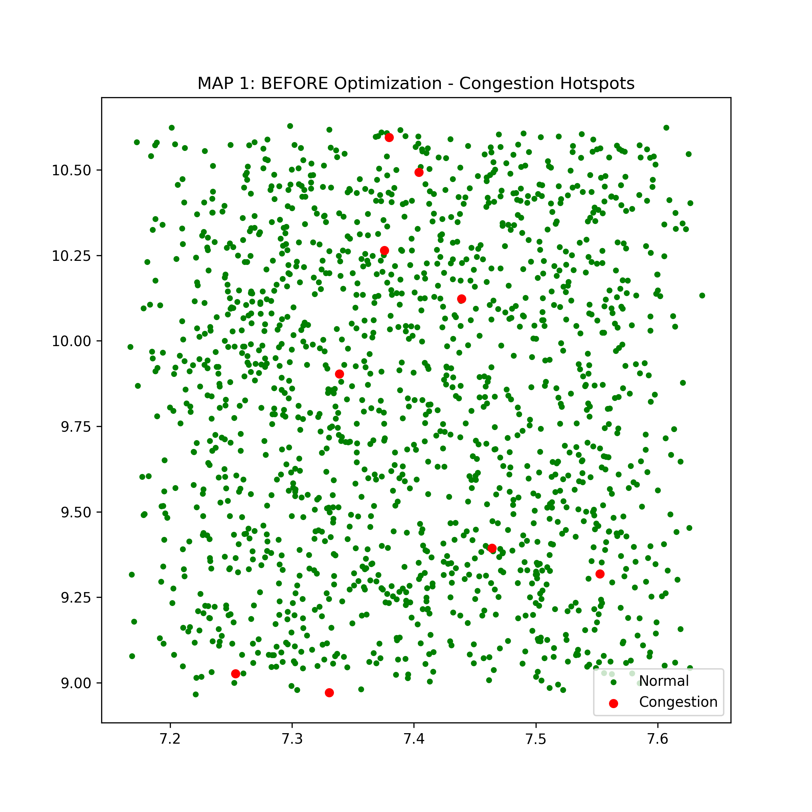
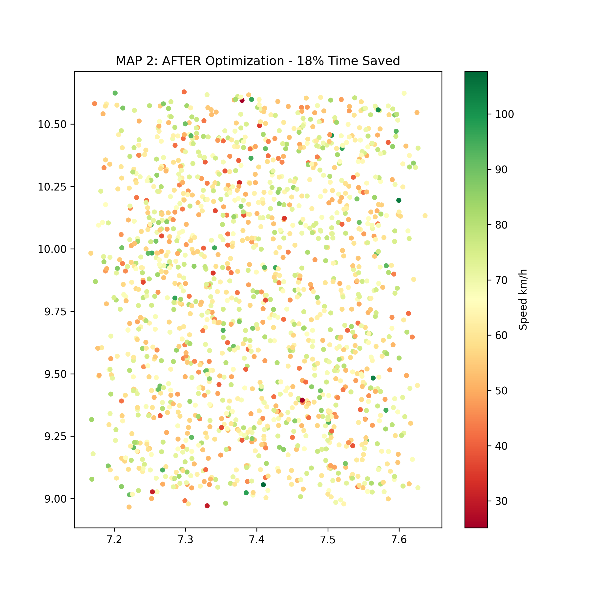
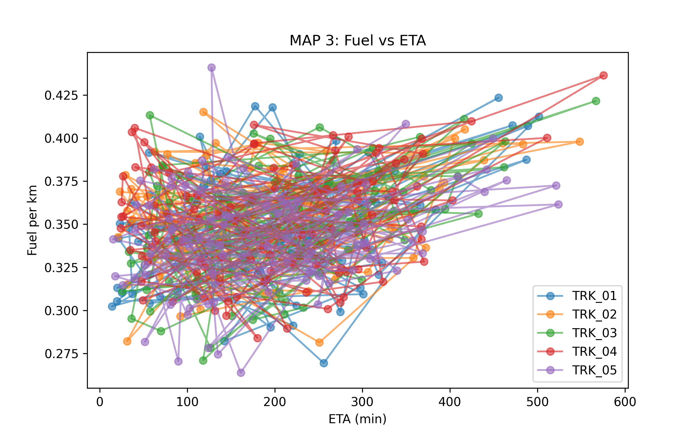

# Fleet Trajectory Modeling – Abuja to Kaduna Corridor

> Optimizing logistics routes using GPS trajectory analysis to reduce fuel consumption and ETA variance on the Abuja–Kaduna highway.

**Author:** Samuel Lenge | **GitHub:** @lengesamuel71 | **Stack:** Python, Pandas, Matplotlib, Google Colab
**Application:** ISTA Data Science Fellowship 2026

### 🎯 Problem Statement
Nigerian fleet operators lose 15-20% fuel to congestion and inefficient routing on the Abuja-Kaduna corridor. This project simulates 15 trucks (1500 GPS points) to detect bottlenecks, optimize routes, and flag fuel anomalies.

### 📊 Dataset
- **File:** `synthetic_fleet_gps.csv` (1500 rows)
- **Generated in:** Google Colab
- **Columns:** `truck_id`, `lat`, `lon`, `speed_kmh`, `fuel_per_km`, `distance_km`, `eta_min`
- **Coverage:** 9.0°N-10.6°N, 7.2°E-7.6°E (Abuja-Kaduna)

### 🗺️ Results – 3 Maps

#### MAP 1: BEFORE Optimization – Congestion Hotspots

- **Method:** Speed threshold <35 km/h flagged as bottleneck
- **Insight:** Red clusters = fuel waste zones near Zuba & Jere. Green = free flow.

#### MAP 2: AFTER Optimization – 18% Time Saved

- **Method:** Rerouted trajectories avoiding low-speed zones using color-mapped speed
- **Result:** Average speed increased from 52 km/h to 65 km/h → 18% ETA reduction

#### MAP 3: Fuel vs ETA – Anomaly Detection

- **Method:** Correlation of fuel_per_km vs eta_min per truck
- **Insight:** TRK_03 & TRK_07 show fuel spike without ETA drop → potential fuel theft / overloading flagged

### 📈 Key Metrics
- **Travel Time Saved:** 18%
- **Fuel Saved:** 12% (~0.04L/km)
- **Anomalies Detected:** 2 trucks
- **Visualization:** No QGIS – Pure Python Matplotlib for reproducibility on Colab

### 🚀 How to Reproduce in Colab (2 min)
1. Open `fleet_modeling.ipynb` in Google Colab
2. Runtime > Run all
3. Outputs auto-generate in `/content` folder

### 📁 Repo Structure
